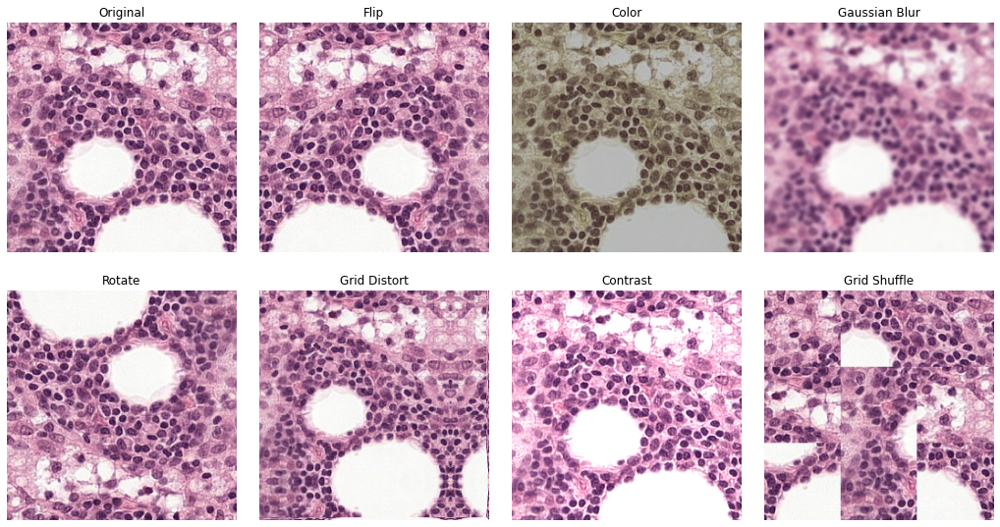

# Learning Representations with Contrastive Self-supervised Learning for Histopathology Application
This is the official repo of the paper [Learning Representations with Contrastive Self-supervised Learning for Histopathology Application](https://arxiv.org/abs/2112.05760) by Karin Stacke, Jonas Unger, Claes Lundström and Gabriel Eilertsen, 2021, Journal of Machine Learning for Biomedical Imaging (MELBA) [https://www.melba-journal.org/papers/2022:023.html](https://www.melba-journal.org/papers/2022:023.html).

The code builds upon the SimCLR implementation from: https://github.com/google-research/simclr.


## Requirements
- Python >= 3.6
- [PyTorch](https://pytorch.org) (version 1.7.0 with cuda 11.0 was used for the experiments in the paper)
- Additional packages listed in `requirements.txt`


## Dataset
This code assumes that images are stored in the `image_dir` folder, and that the there is a comma-separated .csv-file associated with it.
The .csv file should have the following columns:

* `filename` - Image will be loaded as `image_dir/filename`
* `label` - string label matching the label enum associated with the dataset in question, for example TUMOR or NONTUMOR. Will be read but ignored during unsupervised training.
* `slide_id` - Id of slide, used during inference
* `patch_id` - Optional unique id of image patch. If missing, filename will be used instead. Used during inference.

Dataset csv-files used to generate the results in the paper can be found [here](https://computergraphics.on.liu.se/ssl-pathology/datasets/). These also include patch-coordinates, for re-sampling of the dataset patches.

## Usage

Please see `./simclr/main.py` or `./simclr/linear.py` for a full list of arguments/parameters available.

Make sure the repo folder is in the python path. 

### Train SimCLR with pathology data

```
python main.py
required arguments:
--training_data_csv
--test_data_csv
--validation_data_csv
--data_input_dir
--save_dir

optional arguments:
--feature_dim             Feature dim for latent vector [default value is 128]
--temperature             Temperature used in softmax [default value is 0.5]
--batch_size              Number of images per GPU in each mini-batch [default value is 512]
--epochs                  Number of sweeps over the dataset to train [default value is 500]
--dataset                 Dataset to use [default value is cam]
--lr                      Starting learning rate [default value is 1e-3]
--use_album               Bool to use Albumentations instead of Torchvision as augmentation library [default value is false]
--image_size              Image size during training [default value is 224]

```

### Linear Evaluation

Discards multi-linear head and adds a single linear layer. Default mode is to keep pre-trained weights frozen, and only train the added linear layer. Please use the flag `--finetune` to train all weights.

```
python simclr/linear.py
required arguments:
--model_path              Path to pre-trained SimCLR model
OR --pretrained           Use ImageNet as pre-trained model
OR --random               No pre-training, random intialization
--training_data_csv
--test_data_csv
--validation_data_csv
--data_input_dir
--save_dir

optional arguments:
--finetune
--batch_size              Number of images per GPU in each mini-batch [default value is 512]
--epochs                  Number of sweeps over the dataset to train [default value is 100]
--dataset                 Dataset to use [default value is cam]
--lr                      Starting learning rate [default value is 1e-3]
--use_album               Bool to use Albumentations instead of Torchvision as augmentation library [default value is false]
--image_size              Image size during training [default value is 224]
```
### Augmentations



Use either [Torchvision](https://pytorch.org/vision/stable/transforms.html) or [Albumentations](https://albumentations.ai/) as transformation library by using `--use_album` flag.

From parameters, the following augmentations can be controlled (see example image above):

```
--image_size              A smaller size than input image will during training mean random crop
--scale 0.95 1.0          Random resize crop with scale interval
--rgb_gaussian_blur_p     Probability of applying gaussian blur
--rgb_jitter_d            Color jitter parameter
--rgb_jitter_p            Probability of color jitter parameter
--rgb_contrast            Contrast
--rgb_contrast_p          Probability of contrast
--rgb_grid_distort_p      Probability of applying grid distrort (Albumentation only)
--rgb_grid_shuffle_p      Probability of applying random grid shuffle (Albumentation only)
```


## Trained models

SimCLR models trained for this paper are available for download. Please see metadata file for exact parameters used for training (including augmentation and hyper parameters).

Below are the SimCLR models given used as pre-trained weights in *Section 5.2 Downstream Performance*. 

| Method | Dataset    | Batch Size | Epochs | Augmentations                  | Download         |
| ------ | ---------- | ---------- | ------ | ------------------------------ | ---------------- |
| SimCLR | Camelyon16 | 4x256=1024 | 200    | Original                       | [model](https://computergraphics.on.liu.se/ssl-pathology/5_2_models/20210711_1302_simclr_org_1.2/128_0.5_200_256_200_model_200.pth) \| [metadata](https://computergraphics.on.liu.se/ssl-pathology/5_2_models/20210711_1302_simclr_org_1.2/metadata_train_cleaned.txt) |
| SimCLR | Camelyon16 | 4x256=1024 | 200    | Base + Scale                   | [model](https://computergraphics.on.liu.se/ssl-pathology/5_2_models/20210712_1851_simclr_org_1.2_noblur/128_0.5_200_256_200_model_200.pth) \| [metadata](https://computergraphics.on.liu.se/ssl-pathology/5_2_models/20210712_1851_simclr_org_1.2_noblur/metadata_train_cleaned.txt) |
| SimCLR | AIDA-LNSK  | 4x256=1024 | 200    | Original                       | [model](https://computergraphics.on.liu.se/ssl-pathology/5_2_models/20210915_1110_skin_1.2_org/128_0.5_200_256_200_model_200.pth) \| [metadata](https://computergraphics.on.liu.se/ssl-pathology/5_2_models/20210915_1110_skin_1.2_org/metadata_train_cleaned.txt) |
| SimCLR | AIDA-LNSK  | 4x256=1024 | 200    | Base + GridDist. + GridShuffle | [model](https://computergraphics.on.liu.se/ssl-pathology/5_2_models/20211022_1528_skin_1.2_dist_shuffle/128_0.5_200_256_200_model_200.pth) \| [metadata](https://computergraphics.on.liu.se/ssl-pathology/5_2_models/20211022_1528_skin_1.2_dist_shuffle/metadata_train_cleaned.txt) |
| SimCLR | Multidata  | 4x256=1024 | 200    | Original                       | [model](https://computergraphics.on.liu.se/ssl-pathology/5_2_models/20210714_0910_simclr_multidata_org/128_0.5_200_256_200_model_200.pth) \| [metadata](https://computergraphics.on.liu.se/ssl-pathology/5_2_models/20210714_0910_simclr_multidata_org/metadata_train_cleaned.txt) |
| SimCLR | Multidata  | 4x256=1024 | 200    | Base + Scale                   | [model](https://computergraphics.on.liu.se/ssl-pathology/5_2_models/20210714_0911_simclr_multidata_org_noblur/128_0.5_200_256_200_model_200.pth) \| [metadata](https://computergraphics.on.liu.se/ssl-pathology/5_2_models/20210714_0911_simclr_multidata_org_noblur/metadata_train_cleaned.txt) |
| SimCLR | Multidata  | 4x256=1024 | 200    | Base + GridDist. + GridShuffle | [model](https://computergraphics.on.liu.se/ssl-pathology/5_2_models/20211022_1529_simclr_multidata_dist_shuffle/128_0.5_200_256_200_model_200.pth) \| [metadata](https://computergraphics.on.liu.se/ssl-pathology/5_2_models/20211022_1529_simclr_multidata_dist_shuffle/metadata_train_cleaned.txt) |

### 
